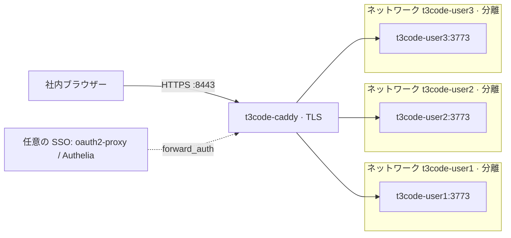

# t3code-podman-workspaces

[](https://github.com/Sunwood-ai-labs/t3code-podman-workspaces/actions/workflows/ci.yml)
[](LICENSE)

[English](README.md)

社内ユーザーごとに、ブラウザーで使える [T3 Code](https://github.com/pingdotgg/t3code) のワークスペースを用意します。ユーザー 1 人につき、`t3 serve` を動かす rootless Podman コンテナを 1 つ、専用の分離ネットワーク上に立てます。Caddy リバースプロキシが `https://<user>.<domain>` で公開します。

| `user1` | `user2` | `user3` |
| --- | --- | --- |
|  |  |  |

1 台のホスト上の 3 つのワークスペースです。それぞれ、ブラウザーから Codex を実行した直後の画面です。利用者と管理者が見分けられるよう、ワークスペースごとに既定のテーマを変えています。

> [!WARNING]
> T3 Code は、任意のコマンドを実行するコーディングエージェントを動かします。コンテナはホストのカーネルを共有し、ワークスペースからの外向き通信は制限していません。信頼できる社内ユーザー向けの構成です。デプロイ前に[セキュリティモデル](docs/security.md)を読んでください。

## できること

- **ユーザーごとのワークスペース**: コンテナ `t3code-<user>` と、`/home/dev`、`/workspace`、`/data` の永続ボリューム。
- **ユーザー間の分離**: ユーザーごとの Podman ネットワーク(`isolate=strict`)、ワークスペースのポート非公開、全ケーパビリティの削除、`no-new-privileges`、メモリ・CPU・PID の上限。
- **ホスト名ごとの HTTPS**: Caddy が TLS を終端し、`<user>.<domain>` をそのユーザーのワークスペースへ中継します(WebSocket を含む)。登録のないホスト名は拒否します。
- **ワークスペースごとのペアリング**: T3 Code の 1 回限りのペアリングリンクでブラウザーをサインインさせます。あるワークスペースのトークンやセッションは、別のワークスペースでは使えません。
- **エージェント同梱**: イメージに T3 Code、Claude Code、Codex をバージョン固定で入れています。
- **systemd による管理**: `users.conf` から Quadlet ユニットを生成します。異常終了時の再起動とヘルスチェック付きです。
- **SSO の接続口(任意)**: oauth2-proxy や Authelia 向けの `forward_auth` スニペットを、コメントアウトした状態で用意しています。

## 構成



Caddy は全ユーザーのネットワークに参加し、ホストのポートを公開する唯一のコンテナです(既定は `8080` と `8443`)。ワークスペース同士は、名前でも IP アドレスでも通信できません。詳しくは[アーキテクチャ](docs/architecture.md)を参照してください。

## 必要なもの

- rootless Podman 5.x、Quadlet 対応の systemd、Bash 4.4 以降が入った Linux ホスト。
- デプロイ用アカウントの subuid / subgid の割り当て。ログインセッションなしで動かし続けるなら `loginctl enable-linger` も必要です。
- `*.<domain>` をホストへ向ける DNS。1 台で試すだけなら `T3_DOMAIN=t3.localhost` で代用できます。
- アイドル時でワークスペース 1 つあたり約 300 MB のメモリと、エージェントが使う分。イメージは約 1.3 GB です。

## クイックスタート

Linux ホスト上で、コンテナを所有するアカウントで実行します。

```bash
git clone https://github.com/Sunwood-ai-labs/t3code-podman-workspaces.git
cd t3code-podman-workspaces

# 1. users.conf(1 行 1 ユーザー)と config.env(ドメイン、ポート、上限)を編集する。

# 2. ワークスペースのイメージをビルドする。
./scripts/build-image.sh

# 3. Quadlet ユニットと Caddyfile を build/ に生成する。
./scripts/render.sh

# 4. ユニットを配置して全体を起動する。
./scripts/install.sh

# 5. デプロイを確認する。
./tests/smoke.sh

# 6. ユーザーごとに 1 回限りのペアリングリンクを発行し、本人にだけ渡す。
./scripts/pair.sh user1
```

利用者がペアリングリンクを開くと、ブラウザーが `https://user1.<domain>:8443` にサインインします。初期設定の画面でエージェントを選び、**Add project → Local folder** で `/workspace` を追加します。

### 1 台で試す

手順 3 の前に、`config.env` で `T3_DOMAIN=t3.localhost` にします。Chromium 系ブラウザーと Firefox は `*.localhost` をループバックアドレスに解決するので、DNS も hosts ファイルも使わずに `https://user1.t3.localhost:8443` を開けます。Caddy のルート証明書を信頼させるまでは、ブラウザーが証明書の警告を出します。

## 設定

ユーザーは [users.conf](users.conf) に 1 行 1 名で書きます。使えるのは小文字の英数字とハイフンです。共通設定は [config.env](config.env) にあります。

| 設定 | 既定値 | 意味 |
| --- | --- | --- |
| `T3_DOMAIN` | `t3.example.internal` | ワークスペースを `<user>.<T3_DOMAIN>` で公開します。 |
| `T3_VERSION` | `0.0.45` | イメージに入れる T3 Code の npm バージョン。 |
| `T3_IMAGE` | `localhost/t3code-workspace:0.0.45` | ビルドして実行するイメージのタグ。 |
| `T3_PORT` | `3773` | コンテナ内で T3 Code が待ち受けるポート。 |
| `T3_MEMORY` / `T3_CPUS` / `T3_PIDS_LIMIT` | `4g` / `2` / `2048` | ワークスペース 1 つあたりの上限。 |
| `CADDY_IMAGE` | `docker.io/library/caddy:2` | リバースプロキシのイメージ。 |
| `CADDY_HTTP_PORT` / `CADDY_HTTPS_PORT` | `8080` / `8443` | Caddy が公開するホストのポート。 |
| `T3_DEFAULT_THEMES` | `ocean grove ember iris t3-chat` | ワークスペースごとの既定テーマ。`users.conf` の順に割り当てます。 |
| `T3_DEFAULT_APPEARANCE` | `dark` | 既定の配色。`system`、`light`、`dark` のいずれか。 |

どちらかのファイルを変えたら、`./scripts/render.sh` と `./scripts/install.sh` を再実行します。

秘密情報はこのリポジトリに入れません。API キーなどユーザーごとの環境変数は、ホスト上の `~/.config/t3code/<user>.env`(モード `600`)に書きます。このファイルは `install.sh` が空で作ります。

## DNS と証明書

ワイルドカード DNS `*.t3.example.internal` をホストへ向けます。試すだけなら hosts ファイルでも構いません(ワイルドカードは使えません)。

```text
192.0.2.10 user1.t3.example.internal user2.t3.example.internal user3.t3.example.internal
```

既定では、Caddy が自前の内部 CA から証明書を発行します。この CA を信頼させるまで、ブラウザーは警告を出します。ルート証明書だけを取り出し、通常の証明書管理の手順で配布してください。

```bash
podman exec t3code-caddy cat /data/caddy/pki/authorities/local/root.crt > t3code-root.crt
```

`root.key` や `t3code-caddy-data` ボリューム全体は配布しないでください。社内 CA の証明書を使う場合は、[caddy/site.tmpl](caddy/site.tmpl) の `tls internal` を置き換えます。

## エージェントのサインイン

利用者は自分のワークスペースの中でエージェントにサインインします。T3 Code の初期設定画面からでも、内蔵ターミナル(`claude auth login`、`codex login`)からでもできます。API キーを使うなら、ホスト上の `~/.config/t3code/<user>.env` に設定します。サインイン後、**Settings → Providers → Refresh provider status** を押すとモデルが一覧に出ます。

1 つのログインを複数人で共有する前に、エージェントの契約条件を確認してください。

## 日々の運用

| やりたいこと | コマンド |
| --- | --- |
| サービスの状態とメモリ使用量を見る | `./scripts/status.sh` |
| デプロイを確認する | `./tests/smoke.sh` |
| ペアリングリンクを再発行する | `./scripts/pair.sh <user> [--ttl 15m]` |
| ユーザーを追加・削除する | `users.conf` を編集し、`./scripts/render.sh && ./scripts/install.sh` |
| 1 つのワークスペースのログを見る | `journalctl --user -u t3code-<user>.service` |
| サービスを削除し、データは残す | `./scripts/uninstall.sh` |
| サービスとデータを削除する | `./scripts/uninstall.sh --purge-volumes` |

更新、バックアップ、トラブルシュートは[運用手順](docs/operations.md)にあります。

## リポジトリの構成

| パス | 内容 |
| --- | --- |
| `users.conf`、`config.env` | 2 つの入力。誰にワークスペースを作るかと、共通設定。 |
| `image/` | ワークスペースイメージの Containerfile と entrypoint。 |
| `quadlet/` | ユーザーごとのネットワークとコンテナのユニットのテンプレート。 |
| `caddy/` | Caddyfile と Caddy ユニットのテンプレート。 |
| `scripts/` | ビルド、生成、配置、削除、ペアリング、状態表示。 |
| `tests/smoke.sh` | 配置後の確認。ユーザー間の分離も検査します。 |
| `docs/` | アーキテクチャ、セキュリティ、運用、イメージ、テスト記録。 |

## ドキュメント

- [アーキテクチャ](docs/architecture.md)(英語): コンポーネント、リクエストの流れ、データの置き場、限界。
- [セキュリティ](docs/security.md)(英語): この構成で守れること、守れないこと、追加で推奨する対策。
- [運用手順](docs/operations.md): セットアップ、ユーザー管理、ペアリング、API キー、更新、バックアップ、トラブルシュート。
- [イメージ](docs/image.md): イメージの内容と、プロキシ配下の T3 Code について分かったこと。
- [結合テストの記録](docs/integration-test.md)(英語): 試したこと、直したこと、試していないこと。

## 状態 / Status

2026-10-04 に、rootless Podman 5.8 の開発用マシン(WSL)上で、3 ユーザー構成を 1 回テストしました。本番の Linux ホストでは試していません。

**確認済み:** Caddy 経由の HTTPS と WebSocket、ペアリング、ユーザー間のセッション分離、ワークスペース間のネットワーク分離、リソース上限、再起動後のデータ保持、異常終了からの復旧、既定テーマ。ブラウザーでは、3 つのワークスペースそれぞれでペアリングと初期設定を済ませ、Claude Code と Codex の両方で `/workspace` にファイルを作らせました。このエージェントのテストには、既存のサブスクリプションのログインをワークスペースへコピーして使っています。

**未確認:** ワークスペース内からのエージェントのサインイン、API キーの設定、ホストの再起動、SELinux の enforcing モード、SSO、社内 CA の証明書、4 ユーザー以上の構成。

**未実装:** 外向き通信の制限。ワークスペースは、インターネットと、ホストから届く社内ネットワークへ到達できます。

**分かっている挙動:** T3 Code の `--auto-bootstrap-project-from-cwd` ではプロジェクトが作られなかったため、利用者が `/workspace` を自分で追加します。T3 Code は `0.0.x` 系で変化が速いので、バージョンを `config.env` で固定しています。既定テーマの仕組みは、そのバージョンの内部実装に依存します。

詳細は[結合テストの記録](docs/integration-test.md)にあります。

## ライセンス

[MIT](LICENSE)。T3 Code、Claude Code、Codex、Caddy、Podman は別のプロジェクトで、それぞれのライセンスと利用条件に従います。
