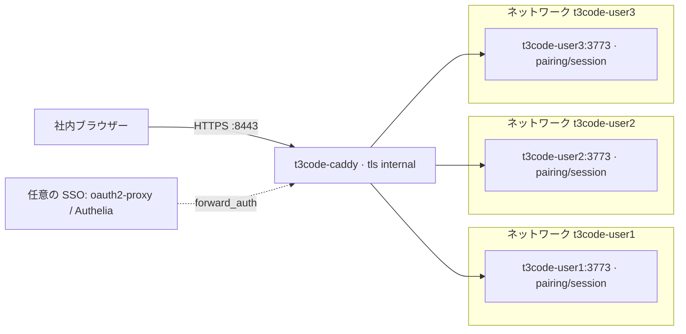

# t3code-podman-workspaces

[English](README.md)

Linux ホストの rootless Podman 5.x と systemd Quadlet を使い、社内ユーザーごとに T3 Code の `t3 serve` コンテナを1つ起動する構成です。Caddy を経由して `user1`、`user2`、`user3` に HTTPS アクセスを提供します。リポジトリは公開ですが、デプロイ先は信頼できる社内ユーザー向けです。

T3 Code は任意のコマンドやコードを実行できるエージェントをホストします。コンテナはホストの Linux カーネルを共有します。導入前に[セキュリティモデル](docs/security.md)を確認してください。

## 構成



Caddy は3つのネットワークに参加し、各ホスト名への要求を対応する `t3code-<user>:3773` に転送します。各ユーザーコンテナは自身のネットワークに参加し、**ホストへポートを公開しません**。Caddy のみがホストの `8080`（HTTP）と `8443`（HTTPS）を公開します。ネットワーク分離は設計上の境界であり、敵対的なワークロードに対する隔離を保証するものではありません。

## 前提条件

- rootless Podman **5.x**、Quadlet 対応の systemd、Bash を備える Linux ホスト。スクリプトは rootless 環境を所有するホストアカウントで実行します。
- subordinate UID/GID の割り当てとユーザー systemd マネージャー。ログアウト後や起動時にも稼働させる場合は lingering を設定します。詳しくは[運用文書](docs/operations.md)を参照してください。
- 各エージェント用ワークスペースを稼働させるリソースと、ビルド依存物・許可したモデルプロバイダー/Git リモートへの通信経路。
- 社内 DNS、クライアント側の内部 CA 信頼設定、許可したネットワークから Caddy の公開ポートへのファイアウォール設定。

ユーザー名は [users.conf](users.conf) に1行ずつ記載します。使える文字は英小文字・数字・ハイフンです。共通設定は [config.env](config.env) にあります。

| 設定 | 既定値 |
| --- | --- |
| `T3_DOMAIN` | `t3.example.internal` |
| `T3_VERSION` | `0.0.45`（T3 Code npm パッケージ） |
| `T3_IMAGE` | `localhost/t3code-workspace:0.0.45` |
| `T3_PORT` | `3773`（コンテナ内ポート） |
| `CADDY_IMAGE` | `docker.io/library/caddy:2` |
| `CADDY_HTTP_PORT` / `CADDY_HTTPS_PORT` | `8080` / `8443`（ホスト公開ポート） |

## DNS と証明書の信頼設定

ワイルドカード DNS `*.t3.example.internal` を Linux ホストの到達可能な IP アドレスへ向けます。手元で試す場合は `/etc/hosts`（Linux/macOS）または `C:\Windows\System32\drivers\etc\hosts`（Windows）に個別の名前を登録します。hosts ファイルはワイルドカードに対応しません。以下の IP はホストの実際のアドレスに置き換えてください。

```text
192.0.2.10 user1.t3.example.internal user2.t3.example.internal user3.t3.example.internal
```

hosts ファイルを編集できない場合は、同じマシン上での試用に限り、`config.env` で `T3_DOMAIN=t3.localhost` にできます。Chromium 系ブラウザーと Firefox は `*.localhost` をループバックアドレスに解決するので、DNS なしで `https://user1.t3.localhost:8443` を開けます。

既定は Caddy の `tls internal` です。Caddy の初回起動後、管理者が `t3code-caddy-data` ボリュームから **`root.crt` のみ**を安全に取り出し、管理対象の社内端末へ配布します。実際のボリューム構成を確認してください。内容の場所を調べる方法には `podman volume mount t3code-caddy-data` があり、rootless 環境では `podman unshare` が必要になる場合があります。ホストの保存先を固定パスと決めつけないでください。[Podman のボリュームマウント文書](https://docs.podman.io/en/latest/markdown/podman-volume-mount.1.html)も参照してください。

管理者との信頼できる経路で証明書のフィンガープリントを確認し、組織の証明書管理手順に従って OS/ブラウザーの信頼されたルート証明書ストアへ登録します。**CA の秘密ルート鍵（`root.key`）やデータボリューム全体は配布しません。** コンテナの起動だけではクライアント端末に信頼設定されません。[Caddy のローカル HTTPS 文書](https://caddyserver.com/docs/automatic-https#local-https)を参照してください。

## クイックスタート

Linux ホスト上のリポジトリルートで、次の順に実行します。

1. [scripts/build-image.sh](scripts/build-image.sh) で指定バージョンの T3 Code イメージをビルドします。

   ```bash
   ./scripts/build-image.sh
   ```

2. [scripts/render.sh](scripts/render.sh) で `users.conf` と `config.env` から Caddy と Quadlet の設定を生成します。

   ```bash
   ./scripts/render.sh
   ```

3. [scripts/install.sh](scripts/install.sh) で生成したユニットをインストールします。[運用文書](docs/operations.md)の起動・再起動手順に従い、Caddy と対象ワークスペースの稼働を確認します。この段階で、前述の CA 証明書を配布して端末に信頼設定します。

   ```bash
   ./scripts/install.sh
   ```

4. [scripts/pair.sh](scripts/pair.sh) で各ユーザーのワンタイム pairing リンクを取得します。呼び出し形式は `./scripts/pair.sh <user>` です。

   ```bash
   ./scripts/pair.sh user1
   ./scripts/pair.sh user2
   ./scripts/pair.sh user3
   ```

   リンクは該当ユーザーへ個別に安全な経路で渡してください。T3 Code の pairing によるセッション確立は必須であり、任意の SSO を導入しても省略できません。

5. 証明書を信頼設定したユーザーのブラウザーで pairing リンクを開き、pairing を完了して `https://<user>.t3.example.internal:8443` にアクセスします。例は `https://user1.t3.example.internal:8443` です。公開ポートは `8443` なので、明示した HTTPS URL を使用してください。

`CADDY_HTTPS_PORT=443` に設定した場合、公開 URL に `:443` は付けません。

## ユーザーの追加

`users.conf` に有効なユーザー名を追加し、`./scripts/render.sh` と `./scripts/install.sh` を再実行します。[運用文書](docs/operations.md)に従い、新しいワークスペースを起動し、Caddy を含む変更対象のサービスを再起動します。必要に応じて DNS/hosts を追加し、新しいユーザーに `./scripts/pair.sh <user>` を実行します。再起動前に生成されたルートとネットワーク参加設定を確認してください。

## 関連文書

- [設計](docs/architecture.md)：構成要素、リクエスト経路、永続化、制約。
- [セキュリティ](docs/security.md)：現在の境界と追加の推奨対策。
- [イメージ](docs/image.md)：ビルドとワークスペースデータの正確な保存先。
- [運用](docs/operations.md)：インストール、再起動、バックアップ、更新、トラブル対応。

Caddy のアクセスログは stdout/journald を想定し、保存期間や監査手順は運用側で定めます。oauth2-proxy または Authelia を使う `forward_auth` による前段 SSO は任意で、別途設定が必要です。

## 状態 / Status

初期実装です。2026-10-04 に、rootless Podman 5.8 の開発用マシン上で 3 ユーザー構成の結合テストを 1 回実施しました。HTTPS と WebSocket のプロキシ、ペアリング、ユーザーごとのセッション分離、ワークスペース間のネットワーク分離、リソース制限、再起動後のデータ保持を確認しています。詳細は[結合テストの記録](docs/integration-test.md)を参照してください。

ヘッドレス Chrome でも、プロキシ経由でペアリング、初期設定、`/workspace` のプロジェクト追加、ターミナル操作を確認しました。

既存のサブスクリプションログインを使い、Claude Code と Codex がそれぞれブラウザーからの依頼を完了することも確認しました。

**未検証:** ワークスペース内でのエージェントのログインと API キー設定、本番 Linux ホストとホスト再起動、SSO、外向き通信の制限(未実装)。T3 Code は `0.0.x` 系のため、動作と更新は利用環境で確認してください。

## ライセンス

[MIT](LICENSE)。
