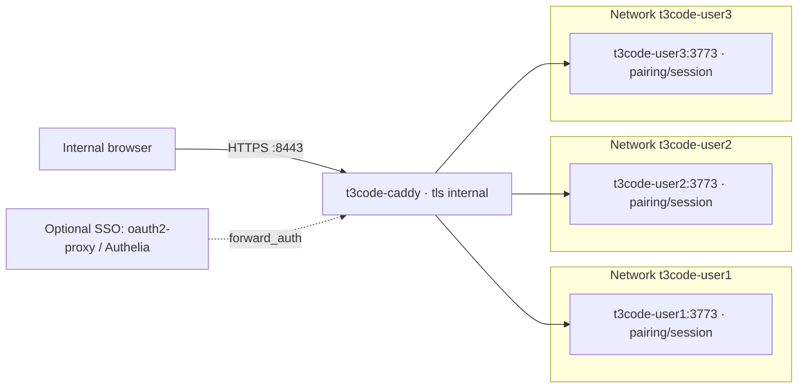

# t3code-podman-workspaces

[日本語](README.ja.md)

Run one T3 Code `t3 serve` container per internal user on a Linux host with rootless Podman 5.x and systemd Quadlet. Caddy provides HTTPS access to `user1`, `user2`, and `user3`. This repository is public; the deployment is intended for trusted internal users.

T3 Code hosts agents that can execute arbitrary commands and code. Containers share the host's Linux kernel. Read the [security model](docs/security.md) before deployment.

## Architecture



Caddy joins all three networks and proxies each hostname to its corresponding `t3code-<user>:3773`. Each user container joins its own network and publishes **no host ports**. Only Caddy publishes host ports `8080` (HTTP) and `8443` (HTTPS). Separate networks are a design boundary, not a guarantee against hostile workloads.

## Prerequisites

- A Linux host with rootless Podman **5.x**, systemd with Quadlet support, and Bash; run the scripts as the host account owning the rootless deployment.
- Working subordinate UID/GID mappings and a user systemd manager. Arrange user lingering if services must survive logout or start at boot; see [operations](docs/operations.md).
- Capacity for each agent workspace, and outbound access to build dependencies and any approved model providers/Git remotes.
- Internal DNS, client trust in the internal CA, and firewall access to the Caddy ports from approved networks.

User names come from [users.conf](users.conf), one per line: lowercase letters, digits, and hyphens. Shared settings come from [config.env](config.env):

| Setting | Default |
| --- | --- |
| `T3_DOMAIN` | `t3.example.internal` |
| `T3_VERSION` | `0.0.45` (T3 Code npm package) |
| `T3_IMAGE` | `localhost/t3code-workspace:0.0.45` |
| `T3_PORT` | `3773` (container port) |
| `CADDY_IMAGE` | `docker.io/library/caddy:2` |
| `CADDY_HTTP_PORT` / `CADDY_HTTPS_PORT` | `8080` / `8443` (host ports) |

## DNS and certificate trust

Point wildcard DNS `*.t3.example.internal` to the Linux host's reachable IP address. For a local trial, add explicit entries to `/etc/hosts` (Linux/macOS) or `C:\Windows\System32\drivers\etc\hosts` (Windows); hosts files do not support wildcards. Replace this example IP with your host's address:

```text
192.0.2.10 user1.t3.example.internal user2.t3.example.internal user3.t3.example.internal
```

The default is Caddy `tls internal`. After Caddy first starts, an administrator must securely extract **only `root.crt`** from the `t3code-caddy-data` volume and distribute it to managed internal clients. Inspect the actual volume layout; `podman volume mount t3code-caddy-data` is one way to locate its contents, and rootless mounting may require `podman unshare`. Do not assume a fixed host storage path. See [Podman's volume mounting documentation](https://docs.podman.io/en/latest/markdown/podman-volume-mount.1.html).

Verify the certificate's fingerprint through a trusted administrator channel, then import it into the clients' OS/browser trusted root store using your organization’s certificate management process. **Never distribute the CA private root key (`root.key`) or the entire data volume.** Containers do not automatically establish trust on client machines; see [Caddy's local HTTPS documentation](https://caddyserver.com/docs/automatic-https#local-https).

## Quick start

Run these steps on the Linux host from the repository root:

1. Build the pinned T3 Code image with [scripts/build-image.sh](scripts/build-image.sh):

   ```bash
   ./scripts/build-image.sh
   ```

2. Render the Caddy and Quadlet configuration from `users.conf` and `config.env` with [scripts/render.sh](scripts/render.sh):

   ```bash
   ./scripts/render.sh
   ```

3. Install the rendered units with [scripts/install.sh](scripts/install.sh). Follow [operations](docs/operations.md) for service startup/restart and confirm Caddy and the intended workspace are running. At this point, distribute and trust the CA certificate as described above.

   ```bash
   ./scripts/install.sh
   ```

4. Obtain a one-time pairing link for each user with [scripts/pair.sh](scripts/pair.sh), whose invocation is `./scripts/pair.sh <user>`:

   ```bash
   ./scripts/pair.sh user1
   ./scripts/pair.sh user2
   ./scripts/pair.sh user3
   ```

   Deliver each pairing link privately to its intended user. Pairing establishes the required T3 Code session; optional SSO does not replace it.

5. Open the corresponding pairing link in the user's trusted browser, complete pairing, and access `https://<user>.t3.example.internal:8443`, for example `https://user1.t3.example.internal:8443`. Use the explicit HTTPS URL; the public port is `8443`.

If you configure `CADDY_HTTPS_PORT=443`, omit `:443` from the public URL.

## Add a user

Add a valid user name to `users.conf`, rerun `./scripts/render.sh` and `./scripts/install.sh`, then start the new workspace and restart affected services, including Caddy, following [operations](docs/operations.md). Add DNS/hosts coverage if needed and run `./scripts/pair.sh <user>` for the new user. Review the rendered routes and network membership before the restart.

## Documentation

- [Architecture](docs/architecture.md): components, request flow, persistence, and limits.
- [Security](docs/security.md): current boundaries and additional recommended controls.
- [Image](docs/image.md): image build and exact workspace data locations.
- [Operations](docs/operations.md): install, restart, backups, updates, and troubleshooting.

The image and operations documents are being prepared separately; links may be unavailable until integrated. Caddy access logs are intended for stdout/journald; retention and audit procedures are deployment responsibilities. SSO via `forward_auth` with oauth2-proxy or Authelia is optional and requires separate configuration.

## Status

Initial implementation. The coordinating maintainer plans to run integration tests and record their results later; **no integration test results are available yet**. T3 Code is on the `0.0.x` release line; validate behavior and upgrades in your environment.

## License

[MIT](LICENSE).
