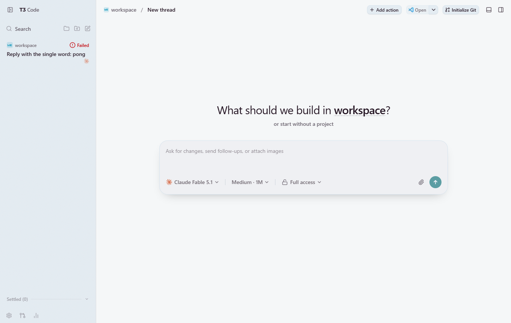
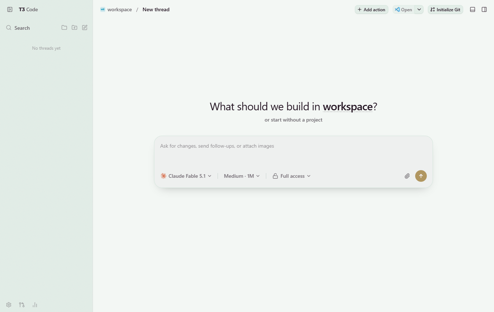
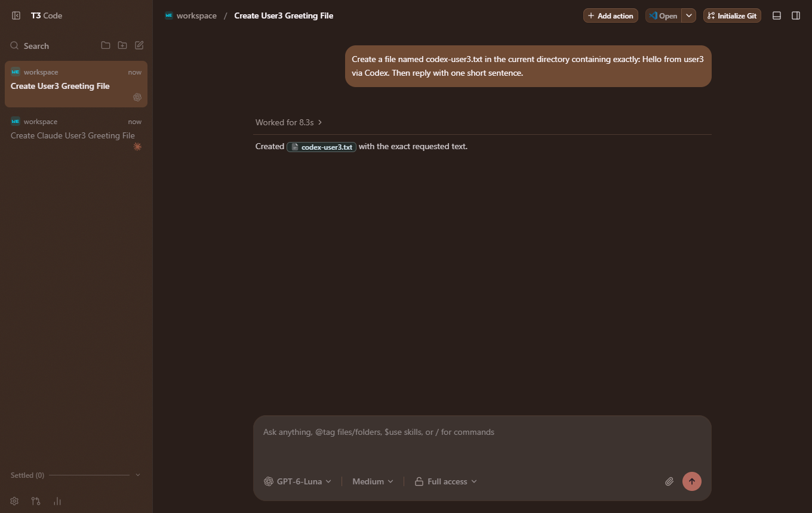
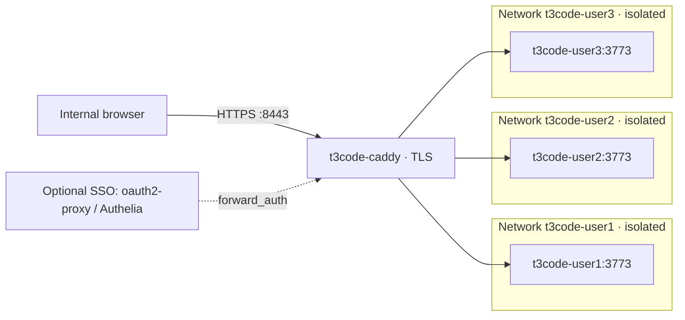

# t3code-podman-workspaces

[](https://github.com/Sunwood-ai-labs/t3code-podman-workspaces/actions/workflows/ci.yml)
[](LICENSE)

[日本語](README.ja.md)

Give each internal user their own [T3 Code](https://github.com/pingdotgg/t3code) workspace in the browser. Every user gets one rootless Podman container running `t3 serve`, on its own isolated network, behind a Caddy reverse proxy that serves `https://<user>.<domain>`.

| `user1` | `user2` | `user3` |
| --- | --- | --- |
|  |  |  |

Three workspaces on one host, each after a Codex run started from the browser. Every workspace opens with its own default theme so that users and administrators can tell them apart.

> [!WARNING]
> T3 Code runs coding agents that execute arbitrary commands. Containers share the host kernel, and outbound traffic from a workspace is not restricted. This setup is for trusted internal users. Read the [security model](docs/security.md) before deploying.

## What you get

- **One workspace per user**: container `t3code-<user>` with persistent volumes for `/home/dev`, `/workspace` and `/data`.
- **Isolation between users**: one Podman network per user with `isolate=strict`, no published ports on workspaces, all capabilities dropped, `no-new-privileges`, and memory, CPU and PID limits.
- **HTTPS by hostname**: Caddy terminates TLS and proxies `<user>.<domain>` to that user's workspace, including WebSocket. Unknown hostnames are rejected.
- **Pairing per workspace**: T3 Code's one-time pairing link signs a browser in. A token or session from one workspace does not work on another.
- **Agents included**: the image ships T3 Code, Claude Code and Codex at pinned versions.
- **Managed by systemd**: Quadlet units generated from `users.conf`, restarted on failure, with a health check.
- **Optional SSO hook**: a commented `forward_auth` snippet for oauth2-proxy or Authelia.

## Architecture



Caddy joins every user network and is the only container that publishes host ports (`8080` and `8443` by default). Workspaces cannot reach each other by name or by IP address. See [architecture](docs/architecture.md).

## Requirements

- A Linux host with rootless Podman 5.x, systemd with Quadlet, and Bash 4.4 or later.
- Subordinate UID/GID ranges for the deployment account, and `loginctl enable-linger` if services must run without a login session.
- DNS that points `*.<domain>` at the host, or `T3_DOMAIN=t3.localhost` for a trial on one machine.
- Roughly 300 MB of memory per idle workspace, plus what the agents use. The image is about 1.3 GB.

## Quick start

Run these on the Linux host, as the account that will own the containers.

```bash
git clone https://github.com/Sunwood-ai-labs/t3code-podman-workspaces.git
cd t3code-podman-workspaces

# 1. Edit users.conf (one user per line) and config.env (domain, ports, limits).

# 2. Build the workspace image.
./scripts/build-image.sh

# 3. Generate the Quadlet units and the Caddyfile into build/.
./scripts/render.sh

# 4. Install the units and start everything.
./scripts/install.sh

# 5. Check the deployment.
./tests/smoke.sh

# 6. Create a one-time pairing link for each user and send it to them privately.
./scripts/pair.sh user1
```

The user opens the pairing link, which signs the browser in to `https://user1.<domain>:8443`. In the setup screens they choose an agent, then add `/workspace` with **Add project → Local folder**.

### Try it on one machine

Set `T3_DOMAIN=t3.localhost` in `config.env` before step 3. Chromium-based browsers and Firefox resolve `*.localhost` to the loopback address, so `https://user1.t3.localhost:8443` works without DNS or a hosts file. The browser will warn about the certificate until you trust Caddy's root certificate.

## Configuration

Users are listed in [users.conf](users.conf): one name per line, lowercase letters, digits and hyphens. Shared settings are in [config.env](config.env):

| Setting | Default | Meaning |
| --- | --- | --- |
| `T3_DOMAIN` | `t3.example.internal` | Workspaces are served at `<user>.<T3_DOMAIN>`. |
| `T3_VERSION` | `0.0.45` | T3 Code npm version installed in the image. |
| `T3_IMAGE` | `localhost/t3code-workspace:0.0.45` | Image tag built and run. |
| `T3_PORT` | `3773` | Port T3 Code listens on inside the container. |
| `T3_MEMORY` / `T3_CPUS` / `T3_PIDS_LIMIT` | `4g` / `2` / `2048` | Limits for each workspace. |
| `CADDY_IMAGE` | `docker.io/library/caddy:2` | Reverse proxy image. |
| `CADDY_HTTP_PORT` / `CADDY_HTTPS_PORT` | `8080` / `8443` | Host ports published by Caddy. |
| `T3_DEFAULT_THEMES` | `ocean grove ember iris t3-chat` | Default theme per workspace, in `users.conf` order. |
| `T3_DEFAULT_APPEARANCE` | `dark` | Default color scheme: `system`, `light` or `dark`. |

After changing either file, run `./scripts/render.sh` and `./scripts/install.sh` again.

Secrets do not belong in this repository. Per-user environment variables such as API keys go in `~/.config/t3code/<user>.env` on the host (mode `600`), which `install.sh` creates empty.

## DNS and certificates

Point wildcard DNS `*.t3.example.internal` at the host. For a trial, hosts file entries also work (they do not support wildcards):

```text
192.0.2.10 user1.t3.example.internal user2.t3.example.internal user3.t3.example.internal
```

By default Caddy issues certificates from its own internal CA. Browsers warn until that CA is trusted. Export only the root certificate and distribute it through your normal certificate management:

```bash
podman exec t3code-caddy cat /data/caddy/pki/authorities/local/root.crt > t3code-root.crt
```

Never distribute `root.key` or the whole `t3code-caddy-data` volume. To use certificates from your own CA instead, replace `tls internal` in [caddy/site.tmpl](caddy/site.tmpl).

## Agent sign-in

Each user signs their agents in inside their own workspace, either from the T3 Code setup screens or from the built-in terminal (`claude auth login`, `codex login`). API keys can instead be set in `~/.config/t3code/<user>.env` on the host. After signing in, **Settings → Providers → Refresh provider status** makes the models appear.

Check the terms of your agent subscriptions before sharing one login between several people.

## Day-to-day operations

| Task | Command |
| --- | --- |
| Show service state and memory use | `./scripts/status.sh` |
| Verify the deployment | `./tests/smoke.sh` |
| New pairing link | `./scripts/pair.sh <user> [--ttl 15m]` |
| Add or remove a user | Edit `users.conf`, then `./scripts/render.sh && ./scripts/install.sh` |
| Logs for one workspace | `journalctl --user -u t3code-<user>.service` |
| Remove the services, keep the data | `./scripts/uninstall.sh` |
| Remove the services and the data | `./scripts/uninstall.sh --purge-volumes` |

Upgrades, backups and troubleshooting are covered in [operations](docs/operations.md).

## Repository layout

| Path | Contents |
| --- | --- |
| `users.conf`, `config.env` | The two inputs: who gets a workspace, and shared settings. |
| `image/` | Containerfile and entrypoint for the workspace image. |
| `quadlet/` | Templates for the per-user network and container units. |
| `caddy/` | Templates for the Caddyfile and the Caddy unit. |
| `scripts/` | Build, render, install, uninstall, pair and status. |
| `tests/smoke.sh` | Post-install checks, including isolation between users. |
| `docs/` | Architecture, security, operations, image notes and the test record. |

## Documentation

- [Architecture](docs/architecture.md): components, request flow, storage and limits.
- [Security](docs/security.md): what this setup protects, what it does not, and recommended additions.
- [Operations](docs/operations.md) (Japanese): setup, users, pairing, API keys, upgrades, backups and troubleshooting.
- [Image](docs/image.md) (Japanese): image contents and what was learned about T3 Code behind a proxy.
- [Integration test record](docs/integration-test.md): what was tested, what was fixed, and what was not tested.

## Status

Tested once on 2026-10-04 with three users on a rootless Podman 5.8 development machine (WSL), not on a production Linux host.

**Verified:** HTTPS and WebSocket through Caddy, pairing, separation of sessions between users, network isolation between workspaces, resource limits, data persistence across restarts, crash recovery, and the default themes. In a browser, each of the three workspaces paired, completed setup, and ran both Claude Code and Codex to create a file in `/workspace`. That agent test used existing subscription logins copied into the workspaces.

**Not verified:** signing agents in from inside a workspace, API-key setup, a host reboot, SELinux in enforcing mode, SSO, corporate CA certificates, and more than three users.

**Not implemented:** outbound traffic filtering. Workspaces can reach the internet and any internal network the host can reach.

**Known behavior:** T3 Code's `--auto-bootstrap-project-from-cwd` did not create a project, so users add `/workspace` themselves. T3 Code is on the `0.0.x` release line and changes quickly; the version is pinned in `config.env`, and the default themes depend on internals of that version.

Details are in the [integration test record](docs/integration-test.md).

## License

[MIT](LICENSE). T3 Code, Claude Code, Codex, Caddy and Podman are separate projects under their own licenses and terms.
