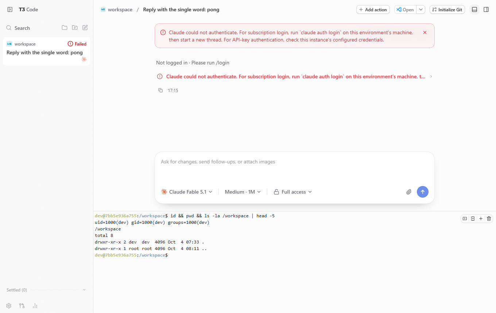

# Integration test record

Date: 2026-10-04. Environment: Windows 11 host, Podman 5.8.3 client, a dedicated rootless WSL Podman machine (Podman 5.8.8, 4 CPU / 8 GiB) with systemd user services and linger enabled. Three users (`user1`, `user2`, `user3`), default `config.env`. Requests were sent with `curl` from inside the machine, using `--resolve` to point `<user>.t3.example.internal` at `127.0.0.1` and Caddy's internal root certificate for verification.

This is a single-run record on a development machine, not a production Linux host.

## Verified

| Area | Check | Result |
| --- | --- | --- |
| Build | `scripts/build-image.sh` | Image `localhost/t3code-workspace:0.0.45` built (about 1.26 GB). |
| Render / install | `scripts/render.sh`, `scripts/install.sh` (and `--dry-run`) | 3 networks, 3 workspace services and Caddy started under `systemctl --user`. `caddy validate` reported a valid configuration. |
| Health | Podman health check | All three workspaces reached `healthy`. |
| HTTPS | `GET https://<user>.t3.example.internal:8443/` for all three users | HTTP 200 over HTTP/2, certificate verified against Caddy's internal root. |
| HTTP redirect | `GET http://user1...:8080/foo?x=1` | 308 to `https://user1...:8443/foo?x=1`. |
| Unknown hosts | Host not in `users.conf` | HTTP: 421. HTTPS: TLS handshake fails (no certificate is issued). |
| Pairing | `scripts/pair.sh user1`, then `POST /api/auth/browser-session` | 200, `authenticated: true`, session cookie issued. |
| One-time use | Same pairing token again | 401. |
| Cross-user token | `user1` pairing token sent to `user2` | 401. |
| Cross-user cookie | `user1` session cookie value sent to `user2` | `authenticated: false`. Each workspace also uses its own cookie name. |
| Cookie attributes | `Set-Cookie` seen through Caddy | `HttpOnly; SameSite=Lax; Secure`, no `Domain`. `Secure` is added by Caddy; T3 Code 0.0.45 does not set it. |
| WebSocket | Upgrade on `/ws` through Caddy | 101 with a session cookie, 101 with a ticket from `POST /api/auth/websocket-ticket`, 401 without credentials. |
| Network isolation | From `t3code-user1`: other workspaces by name and by IP, and Caddy's address on another user's network | All unreachable. Own service by name: 200. |
| Outbound | From `t3code-user1`: `https://registry.npmjs.org/` | 200. Outbound traffic is not restricted. |
| Limits | `podman inspect` | Memory 4 GiB, 2 CPUs, PID limit 2048, all capabilities dropped, `no-new-privileges`, no published ports. |
| Persistence | `systemctl --user restart`, and `uninstall.sh` followed by `install.sh` | Paired session, files in `/workspace` and `/home/dev`, and Caddy's CA survived. `uninstall.sh` kept all 11 volumes. |
| Crash recovery | `podman kill t3code-user3` | Restarted by systemd within about 15 seconds. |
| Browser | Headless Chrome 1360x860 driven by Playwright against `https://user1.t3.localhost:8443` (certificate errors ignored) | Pairing link signed in and redirected to the Welcome flow; the three setup steps completed; `/workspace` was added as a project from the UI; the WebSocket stayed open; the built-in terminal ran `id` as `dev` in `/workspace`; sending a message started Claude Code, which stopped with "Not logged in" because no credentials were configured. |
| Agents | In all three workspaces, with existing Claude Code and Codex subscription logins copied into `/home/dev` (access tokens only, no refresh tokens) | From the browser UI, Claude Code (Claude Sonnet 5.5) and Codex (GPT-6-Luna) each created a file in `/workspace` in `user1`, `user2` and `user3` and replied in the thread: six runs, six files with the expected content. After copying a login, **Settings > Providers > Refresh provider status** was needed before the Codex models appeared. |
| Default themes | Fresh browser profile, one pairing per user | `user1` opened with `ocean`, `user2` with `grove`, `user3` with `ember`, all in the dark color scheme, as set by `T3_DEFAULT_THEMES` and `T3_DEFAULT_APPEARANCE`. See the screenshots below. |
| Idle memory | `scripts/status.sh` | About 250–330 MB per workspace. |

Each screenshot shows a completed Codex run in that workspace.

| `user1` (ocean) | `user2` (grove) | `user3` (ember) |
| --- | --- | --- |
|  |  |  |

The browser run used `T3_DOMAIN=t3.localhost`, because Chromium resolves `*.localhost` to the loopback address without a hosts file entry. The `curl` checks used the default domain.

## Found and fixed during the test

- **Workspaces could reach each other by IP address.** Separate Podman bridge networks block name resolution between networks but still route between them. `t3code-user1` received HTTP 200 from `t3code-user2`'s address. The network units now set `Options=isolate=strict`; the checks above were run after this change. An existing network keeps its old options, so apply this with `uninstall.sh` followed by `install.sh` (volumes are kept).
- **Startup arguments.** The image entrypoint owns the `t3 serve` command line and ignores container arguments, so the Quadlet unit now passes only `T3_PORT`.
- **Session cookie lacked `Secure`.** Caddy appends it.
- **HTTP/3 was advertised on a port that is not published.** Caddy is now limited to HTTP/1.1 and HTTP/2.

## Known behavior

- A workspace can reach Caddy on its own network and request another user's hostname. This is the same access as the public URL and still requires that workspace's pairing or session.
- The first health check runs before the server is listening, which leaves one failed transient `podman healthcheck run` unit per start in `systemctl --user --failed`. The container still becomes `healthy`. Clear it with `systemctl --user reset-failed`.
- `--auto-bootstrap-project-from-cwd` did not create a project: the UI showed "No projects yet" after pairing, and `/workspace` had to be added with **Add project → Local folder**.
- The web UI contacts `clerk.t3.codes` (the optional T3 Connect sign-in) from the browser. The workspace works without signing in.
- `t3 serve` prints an initial pairing URL with a token to the container log at startup. Restrict access to the journal of the deployment account.

## Not verified

- A browser that trusts Caddy's internal CA (the browser run ignored certificate errors), and browsers other than Chrome.
- Agent logins performed inside a workspace (`claude auth login`, `codex login`), API-key authentication through `~/.config/t3code/<user>.env`, and token refresh. The agent test reused existing logins.
- Cursor, Grok, OpenCode and Antigravity. Antigravity needs a separate runtime download of about 682 MB in the workspace and a Google sign-in; neither was attempted.
- Codex's own sandbox. Codex warned that `bubblewrap` is not installed and the run used the Full access mode.
- A production Linux host, a host reboot, SELinux enforcing, and architectures other than amd64.
- SSO through `forward_auth`, and replacing the internal CA with a corporate certificate.
- Outbound filtering and restricting access to internal networks (not implemented).
- Adding and removing users on a running deployment, backup and restore, and image upgrades (documented in [operations](operations.md), exercised only with fixtures or dry runs).
- Behavior under load or with more than three users.
